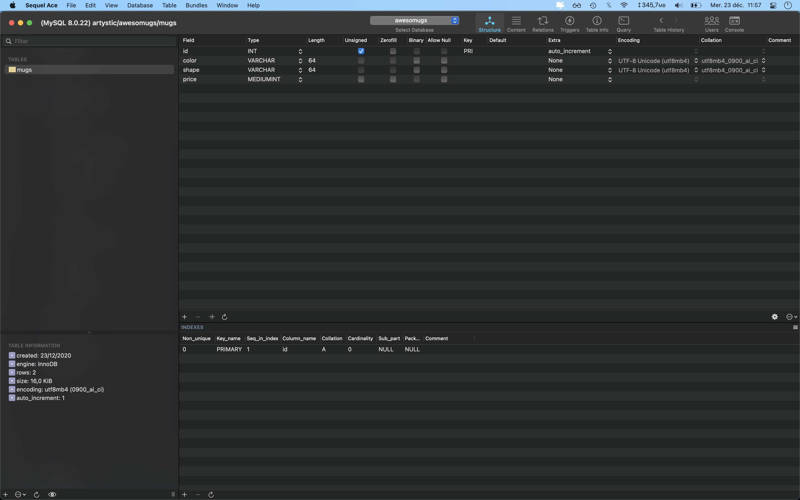

# awesomugs

This app lets you create and index mugs.

## Installation

1. Copy or clone the source code wherever in a PHP served directory in your computer (e.g. `www/`).

2. Then create a local database called `awesomugs` and a table called `mugs` with the following information :

3. Finally add some data in the table `mugs` by executing the SQL queries in `src/database/seeds.sql`.

## Usage

In your favorite browser (which is obviously not Internet Explorer), got to `/` (or `/index.php`). You should then be able to navigate in the app.

- Watch the added mugs in `/mugs-index.php`.
- Add a mug in `/mugs-create.php`.

## Travail personnel

_Vous devez être capable de comprendre et d'expliquer comment toute l'application fonctionne._

Les fichiers présents
- dans `styles/` (fichiers `*.css` et `*.map`),
- dans `scripts/` (fichiers `*.js` et `*.map`)
- et dans `enums`

ne sont pas à considérer, il est inutile de les analyser pour comprendre le fonctinnement de l'application.
Concentrez-vous donc sur les fichiers `*.php`.

Lors du rattrapage, vous devrez développer une évolution pour l'application, puis répondre à quelques questions.